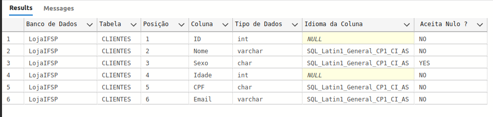

# Banco 3 semestre
Material das aulas de Banco de Dados do  Instituto Federal de Educação e Tecnlogia do Estado de São Paulo.
Após aprender sobre o modelo conceitual, logico e relacional iniciamos a criação de modelos usando o BrModelo.
Modelo de exemplo criado no Drawio.
Na hora de realizar o select devemos tomar cuidado com a ordeque é
COLUNA
TABELA
CONDIÇÃO

Exemplo de retorno do código inserido

Inserindo primeiro registro no banco

-- Exibi Infomarações sobre a estrutura da tabela 
SELECT TABLE_CATALOG    AS 'Banco de Dados',
        TABLE_NAME      AS 'Tabela',
        ORDINAL_POSITION AS 'Posição',
        COLUMN_NAME AS 'Coluna',
        DATA_TYPE AS 'Tipo de Dados',
        COLLATION_NAME AS 'Idioma da Coluna',
        IS_NULLABLE AS ' Aceita Nulo ?'
FROM INFORMATION_SCHEMA.COLUMNS
WHERE TABLE_NAME = 'Clientes';
GO
print da saida no Azure

